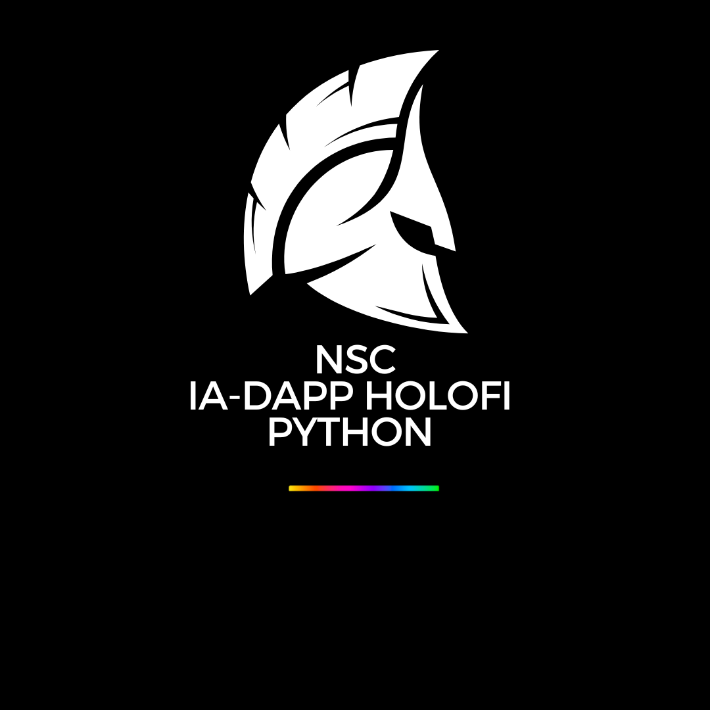

Aqui está a versão atualizada do README para o projeto **NSC IA X HoloFi DApp**. Fiz algumas melhorias e adicionei detalhes relevantes:

---
## 🌎 NSC IA HoloFi SEA 🌎


### Tecnologias Utilizadas

- **C**: Para implementar funcionalidades críticas e componentes de alto desempenho.
- **React.js**: Para construir uma interface de usuário dinâmica e responsiva.
- **Node.js**: Para gerenciamento de operações de backend.
- **HTML5**: Para estruturar o conteúdo da web.
- **CSS3**: Para estilizar e projetar as páginas da web.
- **JavaScript**: Para script e manipulação de interações entre o frontend e o backend.
- **SQL**: Para gerenciamento de banco de dados e consulta de dados de ativos digitais.
- **Shell Script**: Para automação de sistemas e tarefas de integração.

### Descrição

**NSC IA X** é uma plataforma avançada da HoloFi projetada para facilitar aplicativos descentralizados (DApps) e gerenciamento de ativos digitais. Ela integra uma gama de tecnologias de ponta para garantir tokenização, transações e operações de contratos inteligentes de forma segura e eficiente.

### Pré-requisitos

- Compilador **C** (ex.: GCC) instalado em sua máquina.
- **Node.js** e **npm** instalados para gerenciar dependências JavaScript e executar o backend.
- **React.js** instalado e configurado para construir a interface de usuário.
- Configuração do banco de dados **SQL** para gerenciar e consultar dados de ativos digitais.
- Ambiente **Shell** para executar scripts e tarefas de automação.
- Conhecimento básico de C, JavaScript, React.js, Node.js, HTML5, CSS3, SQL e script Shell.

### Instruções de Uso

1. **Clonando o Repositório:**
   ```sh
   git clone https://github.com/seu-usuario/nsc-ia-x-dapp.git
   ```

2. **Instalando Dependências:**
   ```sh
   cd nsc-ia-x-dapp
   npm install
   ```

3. **Configurando a Rede NSC IA X HoloFi:**
   - Certifique-se de que seu cliente NSC IA X esteja operacional e sincronizado.
   - Configure as variáveis de ambiente no arquivo `.env` com os detalhes da sua rede HoloFi.

4. **Implantando Contratos Inteligentes:**
   - Compile e implemente contratos inteligentes na rede HoloFi conforme necessário.
   - Atualize os endereços dos contratos nos arquivos de configuração (`config.js`, etc.) após a implantação.

5. **Construindo o Frontend em React:**
   ```sh
   npm run build
   ```

6. **Executando o DApp:**
   ```sh
   npm start
   ```

7. **Interagindo com o DApp NSC IA X:**
   - Utilize os endpoints da API REST fornecidos para gerenciar ativos digitais e executar transações.
   - Os ativos digitais são representados como tokens personalizáveis na rede HoloFi.

### Integração Planetária

NSC IA X integra funcionalidades avançadas com foco na segurança, transparência e eficiência computacional para DApps, abrangendo tanto a Terra quanto o Espaço.

### Computação Quântica e Criação de Ativos Híbridos

NSC IA X integra soluções inovadoras para a criação de ativos digitais híbridos e computação quântica, expandindo as fronteiras de aplicativos descentralizados e gerenciamento de ativos digitais.

### Novas Configurações

- **Atualização da Configuração do Ambiente**: Inclua as variáveis de ambiente mais recentes relacionadas às capacidades de HORIZON FX e integração quântica em seu arquivo `.env`.
- **Novas Dependências**: Adicionado suporte para bibliotecas de integração quântica e atualizações de Horigami FX.

NSC IA X está na vanguarda da tecnologia HoloFi, fornecendo uma plataforma robusta para aplicativos descentralizados e gerenciamento de ativos digitais. Com integrações avançadas como funcionalidades planetárias e capacidades de computação quântica, NSC IA X está preparado para redefinir o cenário HoloFi.

<p>FOUNDER: LUCAS JANAURIO DO NASCIMENTO</p>



---

Obrigado pela sua atenção!

by NSC
